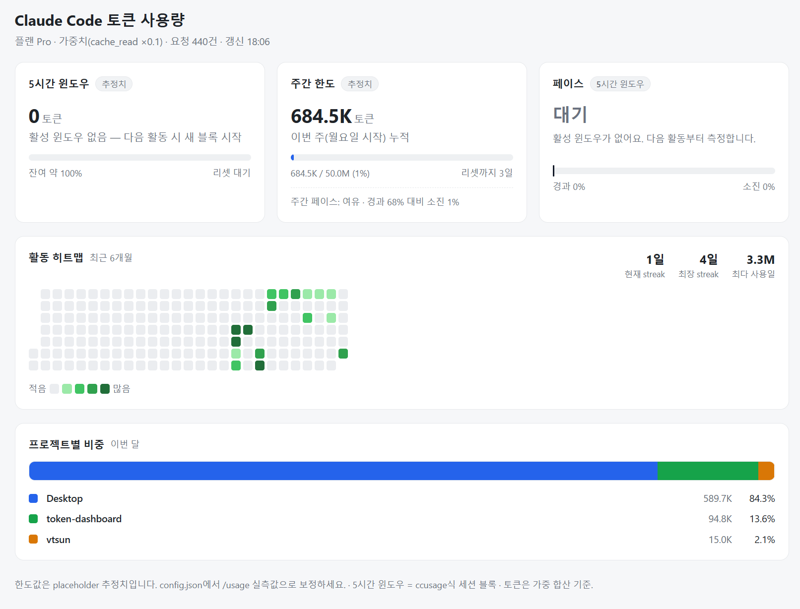
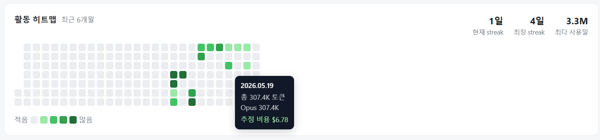
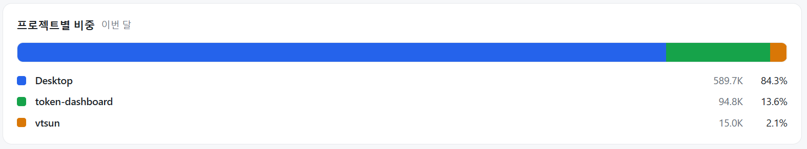

# Claude Code 토큰 사용량 대시보드

각자 PC에 저장된 Claude Code 사용 기록(`~/.claude/projects/**/*.jsonl`)을 읽어
**자기 토큰 사용량을 로컬에서** 보여주는 대시보드입니다.

- 5시간 윈도우 / 주간 한도 / 페이스 카드
- GitHub 잔디 스타일 활동 히트맵 (streak·툴팁·세션 패널)
- 이번 달 프로젝트별 비중

> **데이터는 100% 각자 PC에만 머뭅니다.** 어디에도 업로드하지 않으며,
> 외부 의존성 없는 단일 Node.js 서버가 로컬에서만 동작합니다.

> ⚠️ **집계 범위: Claude Code 사용량만.** claude.ai 웹·데스크톱 앱에서 쓴 토큰은
> 같은 구독 한도를 소비하지만 **포함되지 않습니다** — 웹 사용량은 로컬 기록도 없고
> 구독 사용량 조회 API도 없어 자동 집계가 불가능합니다. 전체 구독 한도 현황은
> Claude Code `/usage` 또는 claude.ai에서 확인하세요.

## 스크린샷

<!-- 캡처한 이미지를 docs/ 폴더에 넣고 아래 경로/설명을 맞춰주세요. -->

### 전체 화면


### 상태 카드 (5시간 윈도우 · 주간 한도 · 페이스)


### 활동 히트맵 (호버 툴팁 · 세션 패널)


### 프로젝트별 비중


---

## 필요한 것
- [Node.js](https://nodejs.org) 16 이상 (`node -v` 로 확인)
- Claude Code 사용 기록 (`~/.claude/projects` 에 자동 생성됨)

## 실행 방법

### 방법 A) 내려받아 실행 (가장 간단, 설치 불필요)
```bash
# 이 폴더를 받은 뒤
cd token-dashboard
npm start
```
의존성이 없어서 `npm install` 도 필요 없습니다. 브라우저가 자동으로 열립니다.

### 방법 B) GitHub에서 바로 실행
저장소에 올렸다면 받는 사람은 클론 후 `npm start` 한 번이면 됩니다.
```bash
git clone <저장소 URL> token-dashboard
cd token-dashboard
npm start
```

### 방법 C) npx / 전역 설치
npm에 publish 했거나 GitHub 주소가 있으면:
```bash
npx <github-user>/<repo>        # 설치 없이 바로
# 또는
npm i -g claude-token-dashboard
claude-token-dashboard
```

실행하면 `http://localhost:5050` 이 열립니다. (포트가 사용 중이면 자동으로 다음 포트로)

## 옵션
| 목적 | 방법 |
|---|---|
| 포트 지정 | `PORT=8080 npm start` |
| 데이터 경로 직접 지정 | `node server.js --dir="D:\\backup\\.claude\\projects"` |
| 〃 (환경변수) | `CLAUDE_PROJECTS_DIR=... npm start` |
| 브라우저 자동 열기 끄기 | `node server.js --no-open` |

## 한도값 보정 (중요)
`config.json` 의 `FIVE_HOUR_LIMIT` / `WEEKLY_LIMIT` 는 **공식 수치가 아닌 임의 placeholder**입니다.
Claude Code에서 `/usage` 로 확인한 실측 한도값으로 직접 바꾸세요.

```jsonc
{
  "CACHE_READ_FACTOR": 0.1,        // weighted = input+output+cache_create + cache_read*이 값
  "FIVE_HOUR_LIMIT": 5000000,      // ← /usage 실측치로 보정
  "WEEKLY_LIMIT": 50000000,        // ← /usage 실측치로 보정
  "PRICING_PER_MTOK": { ... }      // 비용($) 추정 단가 (per 1M tokens)
}
```

## 동작 메모
- 같은 `requestId` 중복 행은 1건으로 dedup, `<synthetic>` 모델은 제외
- 토큰은 **가중 합산**(`input + output + cache_creation + cache_read×0.1`) 기준
- 5시간 윈도우는 ccusage식 **세션 블록**(직전 블록 종료/5h 갭 이후 첫 활동의 정시 내림 = 새 블록 시작)
- 날짜·주 시작·윈도우 계산은 모두 **실행 PC의 로컬 시간** 기준

## 프라이버시
JSONL 파일에는 토큰 수뿐 아니라 **대화 전문이 포함**됩니다.
이 도구는 그 내용을 읽지 않고 토큰 통계만 집계하며, 네트워크로 아무것도 전송하지 않습니다.
공유 서버에 올리지 말고, **각자 자기 PC에서 실행**하세요.
